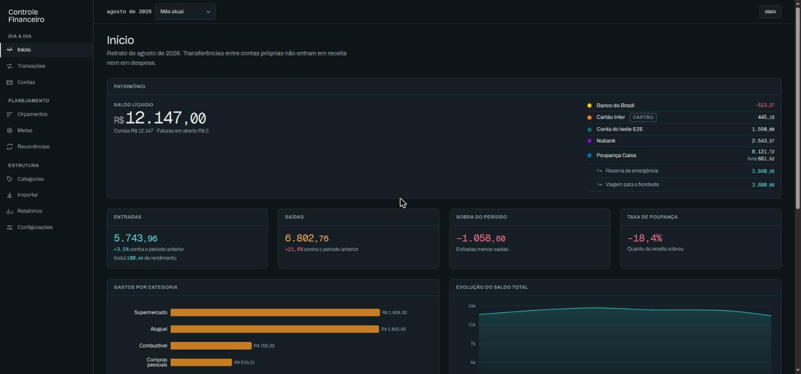
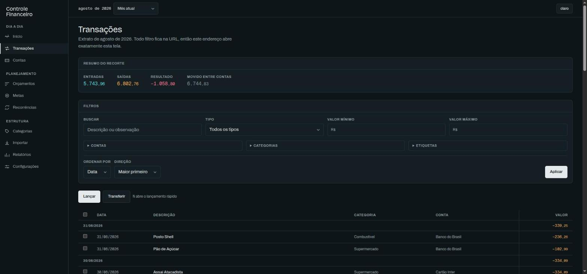
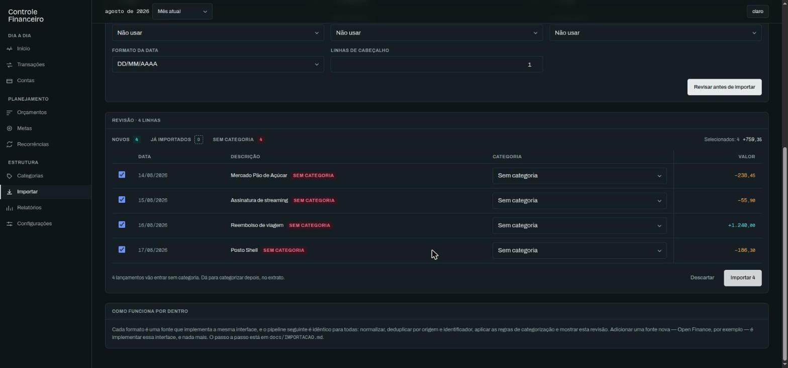
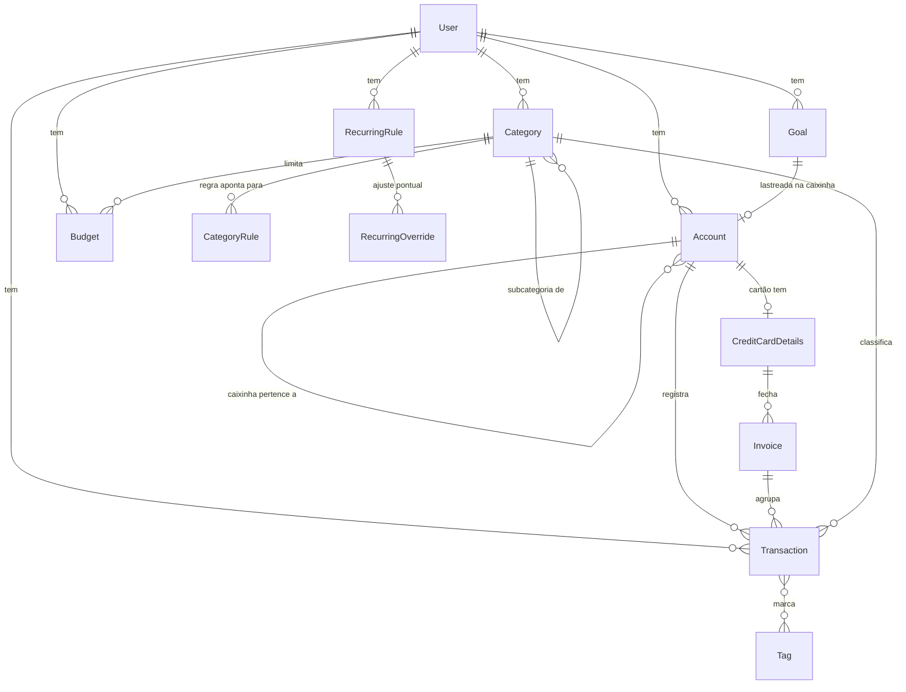
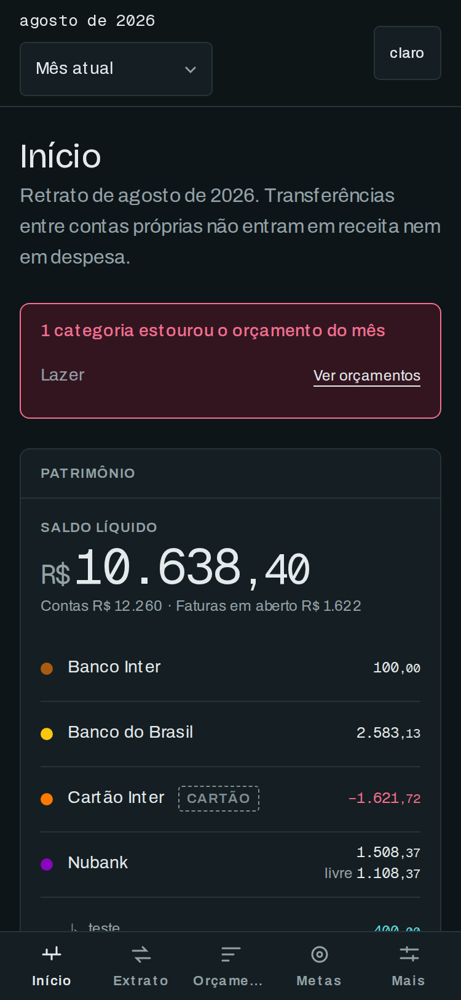
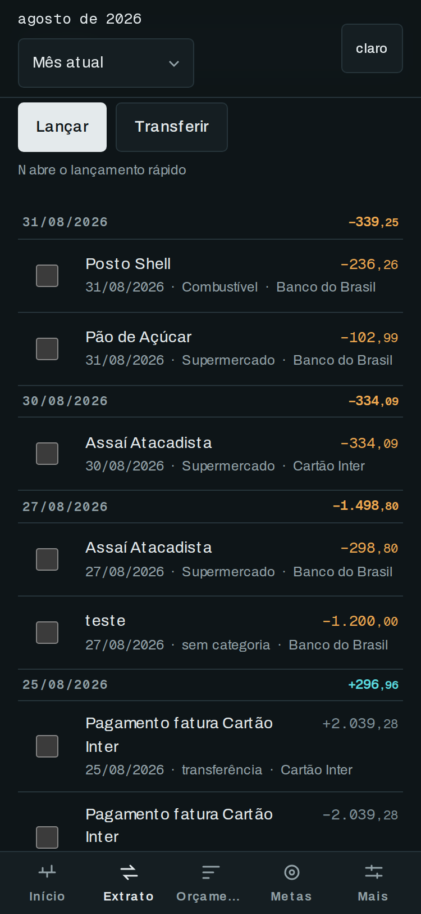

# Controle Financeiro

Um app de finanças pessoais que roda na sua máquina: você lança, importa extrato do banco e
enxerga para onde o dinheiro vai — sem mandar um centavo de informação para lugar nenhum.



<p align="center">
  
  
</p>

## O que ele faz

Contas e cartões com fatura de verdade, extrato com filtros que vivem na URL, categorias em
árvore com regras automáticas, orçamentos com ritmo do mês, metas como caixinhas no ledger,
recorrências que se lançam sozinhas, projeção de saldo para 90 dias, importação de CSV e OFX
com revisão antes de gravar, relatórios, exportação completa e backup.

## Rodando em um comando

```bash
git clone https://github.com/luisleles/Organizador-Financeiro.git
cd Organizador-Financeiro && cp .env.example .env && npx auth secret && npm install && npm run demo
```

`npm run demo` aplica as migrations, semeia **oito meses de dados fictícios** — contas,
cartão com faturas, 300 lançamentos, orçamentos, metas e recorrências — e sobe o app em
[localhost:3000](http://localhost:3000). O terminal imprime o e-mail e a senha sorteada
para entrar. Nada de tela vazia esperando você digitar meio ano de extrato para entender o
que o app faz.

## Stack, e por quê

| Escolha                    | Por quê                                                                                                                                                                                                                                                                                                 |
| -------------------------- | ------------------------------------------------------------------------------------------------------------------------------------------------------------------------------------------------------------------------------------------------------------------------------------------------------- |
| **Next.js 15, App Router** | Server Components leem o banco direto, sem uma camada de API que só repassaria JSON para mim mesmo. Server Actions dão mutação com progressive enhancement: os formulários funcionam antes do JavaScript carregar.                                                                                      |
| **TypeScript strict**      | O domínio é dinheiro. Um `undefined` silencioso aqui é um saldo errado, e o `strict` transforma isso em erro de compilação.                                                                                                                                                                             |
| **SQLite + Prisma**        | É um app de uma pessoa numa máquina. Um Postgres seria um processo a mais para operar, backup a mais para configurar e zero benefício: o banco inteiro cabe num arquivo que dá para copiar. O Prisma entra pelo schema declarativo, migrations versionadas e tipos gerados que combinam com o `strict`. |
| **Tailwind v4**            | Configuração em CSS, com os tokens do design system como fonte única. Cor, no app, tem significado financeiro — e ficar tudo em `globals.css` mantém essa regra num lugar só.                                                                                                                           |
| **Auth.js**                | Sessão em JWT num cookie httpOnly, sem tabela de sessão e sem servidor de identidade. É o mínimo que fecha o app de verdade.                                                                                                                                                                            |
| **Recharts**               | Componível em React, sem canvas: os gráficos herdam os tokens de cor e trocam de tema junto com o resto.                                                                                                                                                                                                |
| **Vitest + Playwright**    | Vitest para as regras, contra um SQLite descartável, em segundos. Playwright para os caminhos que a pessoa percorre, contra o **build de produção** — a diferença já pegou um bug que só existia lá.                                                                                                    |

## Modelo de dados



O detalhe de cada entidade — e o porquê de cada decisão de schema — está em
[docs/MODELO-DE-DADOS.md](docs/MODELO-DE-DADOS.md).

## Decisões técnicas

### Dinheiro é `Int` em centavos, nunca `Float`

`0,1 + 0,2` não dá `0,3` em ponto flutuante binário. Num app de finanças, esse erro não é
teórico: ele aparece como um saldo que fecha com um centavo de diferença e destrói a
confiança na ferramenta inteira. Todo valor é um inteiro de centavos, do banco à API, e só
vira texto na renderização — `formatBRL(123456)` devolve `R$ 1.234,56`. A entrada aceita o
que a pessoa digita de verdade (`1.234,56`, `1234.56`, e até `12,50+8`) e converte na
fronteira.

### Transferência é dupla entrada, não um campo `tipo = TRANSFER`

Mover dinheiro entre contas próprias gera **duas** linhas com o mesmo `transferGroupId`:
uma negativa na origem, uma positiva no destino, somando zero. Poderia ser uma linha só com
duas colunas de conta — e aí todo relatório precisaria de um caso especial para não contar
aquilo como receita ou despesa, e todo saldo precisaria saber ler o campo nos dois sentidos.

Com duas pernas, o saldo de cada conta continua sendo "soma dos lançamentos dela", sem
exceção. Os relatórios excluem `type = TRANSFER` numa cláusula só. E editar ou apagar uma
perna mexe nas duas, dentro da mesma transação de banco. O teste que guarda isso é direto:
uma transferência **não pode** alterar o patrimônio consolidado.

O mesmo raciocínio sustenta as caixinhas das metas: o progresso de uma meta é o saldo de uma
subconta real, e aportar é uma transferência da conta mãe para ela. Antes disso o progresso
era anotação — subia na tela sem o dinheiro sair do lugar.

### Importar é um pipeline, e a fonte é uma interface

CSV e OFX não têm código de importação próprio. Cada formato implementa uma interface de
três campos:

```ts
interface TransactionSource {
  id: string;
  fetchTransactions(params: { accountId: string; since: Date }): Promise<RawTransaction[]>;
}
```

A fonte só busca e devolve. Não conhece Prisma, não decide o que é duplicado, não aplica
regra de categoria e nunca grava. O que vem depois é o mesmo para qualquer origem:
normalizar → deduplicar por `(provider, externalId)` → categorizar → **revisar** → confirmar.

Isso existe porque a próxima fonte já tem nome: Open Finance. Quando ela chegar, é uma
classe nova e um `case` no `createSource`; deduplicação, categorização e tela de revisão já
funcionam para ela. A garantia final contra duplicata não está no código, e sim num índice
único de `(provider, externalId)` no banco — reimportar o mesmo arquivo é seguro por
construção. O passo a passo está em [docs/IMPORTACAO.md](docs/IMPORTACAO.md).

## Qualidade

|                                 |                                                                                               |
| ------------------------------- | --------------------------------------------------------------------------------------------- |
| Testes unitários e de serviço   | 448, em 26 arquivos, com SQLite descartável                                                   |
| Testes E2E                      | Playwright, contra o build de produção: login, criar conta, lançar, transferir e importar CSV |
| Lighthouse (desktop)            | performance 100 · acessibilidade 100 · boas práticas 100                                      |
| Lighthouse (móvel, 4G simulado) | performance 90 · acessibilidade 100 · boas práticas 100                                       |
| CI                              | typecheck, lint, unitários e E2E a cada push                                                  |

As regras difíceis vivem em módulos puros, sem banco e sem React: saldo, fatura de cartão,
ritmo de orçamento, agenda de recorrência, projeção de saldo e o pipeline de importação. É
por isso que a maior parte da suíte roda em milissegundos. A arquitetura está em
[docs/ARQUITETURA.md](docs/ARQUITETURA.md).

## Roadmap

- **Open Finance** pela `TransactionSource` que já existe — é a razão de a abstração ter sido
  construída antes de haver uma segunda fonte de verdade.
- **Lançamento offline com fila de sincronização**: hoje o PWA instala e abre como app, mas
  exige conexão com o servidor. Falta uma fila local só de escrita — nunca de leitura de
  saldo — que sincronize quando a rede voltar.
- **Acesso remoto sem depender do computador ligado**, seja com o app rodando num servidor
  pequeno em casa ou numa VPS, mantendo o mesmo desenho de rede privada do Tailscale.
- **Relatório de imposto de renda**, agrupando o ano por categoria no formato que a
  declaração pede.
- **Multiusuário opcional**, com escopo por família — o `userId` já atravessa toda query, o
  que falta é a interface de convite.
- **Anexo em lançamento**, para guardar a nota fiscal junto da despesa.

## Acesso pelo celular

O app roda no seu computador; o celular só precisa de um caminho até ele. A recomendação é
**Tailscale**: dá HTTPS de verdade — que é o que o PWA exige para instalar —, expõe o app só
para os seus aparelhos, e **o mesmo endereço continua funcionando fora de casa**, sem uma
segunda configuração para "acesso remoto".

```bash
# no computador que roda o app
curl -fsSL https://tailscale.com/install.sh | sh
sudo tailscale up
sudo tailscale serve --bg 3000
```

Depois, e este é o passo que a maioria esquece, conte ao app qual é o endereço dele:

```bash
# .env
AUTH_URL="https://sua-maquina.seu-tailnet.ts.net"
```

Sem `AUTH_URL`, o Auth.js monta o callback do login para `localhost` — que, no celular, é o
próprio celular. A senha é aceita, a tela recarrega e volta para o login **sem mensagem de
erro nenhuma**. É o sintoma mais confuso de toda a configuração, e a causa é sempre esta.

No celular: instale o Tailscale, abra o endereço, faça login e use "Adicionar à Tela de
Início" (iOS) ou "Instalar aplicativo" (Android). O app passa a abrir sem barra de navegador.

O passo a passo completo — incluindo o plano B com Caddy e mkcert na LAN, para quem não
quiser Tailscale — está em [docs/ACESSO-REMOTO.md](docs/ACESSO-REMOTO.md).

<p align="center">
  
  
</p>

### O que muda no celular

A interface foi revista em 375px. O extrato deixa de ser tabela e vira lista de cartões,
porque seis colunas nessa largura truncam justamente a descrição, que é o que faz lembrar do
gasto. Campo de valor abre teclado numérico, diálogos viram folha de baixo — ao alcance do
polegar, que é como se lança um gasto na fila do mercado —, e a barra inferior respeita a
área segura do aparelho.

O app funciona instalado, mas **não funciona offline de propósito**: o service worker guarda
só o shell e os arquivos estáticos. Dado financeiro nunca é cacheado, porque um saldo velho
guardado no disco do navegador é pior do que um aviso de que falta conexão — e é esse aviso
que aparece.

## Abrindo com um clique (Linux)

`scripts/abrir-app.sh` faz tudo sozinho: instala dependências se faltarem, aplica as
migrations, gera os dados de exemplo num banco novo, compila só quando algum arquivo
mudou desde a última build, sobe o servidor e abre o navegador. Se o app já estiver no ar,
ele apenas abre a aba. O atalho roda sem terminal, então o andamento aparece nas
notificações do sistema e o registro completo fica em `data/abrir-app.log`.

`scripts/fechar-app.sh` encerra o servidor. Ele aparece como um segundo atalho, "Fechar
Controle Financeiro", e também como a ação "Fechar o app" no menu de contexto do primeiro.

Para instalar o atalho, com o caminho do projeto já preenchido:

```bash
sed "s|__PROJETO__|$PWD|" scripts/controle-financeiro.desktop \
  > ~/.local/share/applications/controle-financeiro.desktop
sed "s|__PROJETO__|$PWD|" scripts/controle-financeiro.desktop \
  > ~/Desktop/"Controle Financeiro.desktop"
chmod +x ~/Desktop/"Controle Financeiro.desktop"
```

Pelo menu de aplicativos ele abre direto. Na área de trabalho, o GNOME exige uma
autorização única: botão direito no ícone, "Permitir execução".

## Acesso

O app é de uma pessoa só. Na primeira execução, `/login` vira tela de cadastro e cria a
única conta; depois disso ela volta a ser login e o cadastro fecha. Alternativamente,
`npm run db:seed` cria o acesso junto com os dados de exemplo — sem `SEED_PASSWORD`, ele
sorteia uma senha e a imprime uma única vez no terminal.

Esqueceu a senha? `npm run auth:senha` redefine pelo terminal. Quem tem o arquivo do banco
já pode tudo, então não há segredo perdido aqui — só uma forma de voltar a entrar.

Como funciona por dentro:

- **Auth.js** com provider de credenciais e sessão em JWT, num cookie `httpOnly`,
  `sameSite=lax`, válido por 30 dias. `trustHost` está ligado porque o app é auto-hospedado;
  sem isso o Auth.js recusa qualquer host fora da Vercel — e só em produção, já que em
  desenvolvimento ele confia sozinho. Publicando em endereço aberto, fixe a origem em
  `AUTH_URL`.
- **bcrypt com custo 12**, em JavaScript puro — nada de módulo nativo para compilar no
  Docker. O login compara contra um hash descartável quando o e-mail não existe, para o
  tempo de resposta não contar quais e-mails estão cadastrados.
- **Rate limit** de 5 tentativas por minuto por e-mail, com 15 minutos de castigo depois
  disso. Em memória, que é o suficiente para um app que roda numa máquina só.
- **Middleware** protege tudo, menos `/login`, `/api/auth/*` e `/api/saude`. As rotas de
  exportação e de backup entram na proteção: elas despejam o banco inteiro.
- **Toda query filtra por `userId`**, vindo de `requireUserId()` — o ponto único onde a
  identidade entra no domínio.
- **CSP com nonce** e `strict-dynamic`, mais `X-Frame-Options`, `Referrer-Policy`,
  `Permissions-Policy`, HSTS e as políticas de isolamento de origem. O único script inline
  fixo, o que aplica o tema antes da primeira pintura, entra por hash — e um teste garante
  que hash e script não saiam de sincronia.

## Rodando com Docker

Pré-requisitos: Docker e Docker Compose.

```bash
cp .env.example .env
docker compose up
```

A aplicação sobe em [http://localhost:3000](http://localhost:3000) com hot reload
habilitado — alterações em `src/` são refletidas automaticamente. O banco SQLite fica
persistido em `./data/app.db` no host, montado como volume no container.

Para rodar migrations ou o seed dentro do container:

```bash
docker compose exec app npm run db:migrate
docker compose exec app npm run db:seed
```

### Produção

`docker-compose.prod.yml` sobe dois serviços: `migrate`, que aplica as migrations e sai, e
`app`, que só começa depois que o primeiro termina bem.

```bash
cp .env.example .env
npx auth secret            # gera o AUTH_SECRET dentro do .env
docker compose -f docker-compose.prod.yml up -d --build
```

A imagem final usa o `output: "standalone"` do Next e não carrega o CLI do Prisma — ele
tem uma árvore de dependências própria e vive só no estágio `migrate`. O contêiner roda
como usuário sem privilégios, com sistema de arquivos somente leitura, `no-new-privileges`
e um healthcheck em `/api/saude`, que responde 503 se o banco não estiver acessível.

A porta é publicada só em `127.0.0.1`. Para expor à internet, ponha um proxy reverso com
TLS na frente — a sessão vai num cookie, e cookie sem HTTPS é sessão em texto aberto.

## Rodando sem Docker

Pré-requisitos: Node.js 20 ou superior.

```bash
cp .env.example .env
npx auth secret            # gera o AUTH_SECRET dentro do .env
npm install
npm run db:migrate
npm run dev
```

A aplicação sobe em [http://localhost:3000](http://localhost:3000).

## Scripts

| Script               | Descrição                                         |
| -------------------- | ------------------------------------------------- |
| `npm run dev`        | Sobe o servidor de desenvolvimento com hot reload |
| `npm run build`      | Gera o build de produção                          |
| `npm run start`      | Sobe o servidor com o build de produção           |
| `npm run lint`       | Roda o ESLint                                     |
| `npm run format`     | Formata o código com Prettier                     |
| `npm run typecheck`  | Verifica os tipos com o TypeScript                |
| `npm run db:migrate` | Aplica migrations do Prisma em desenvolvimento    |
| `npm run db:seed`    | Popula o banco com dados iniciais                 |
| `npm run db:studio`  | Abre o Prisma Studio para inspecionar o banco     |
| `npm run auth:senha` | Redefine a senha do usuário pelo terminal         |
| `npm run backup`     | Gera um backup do banco e aplica a retenção       |
| `npm run test:e2e`   | Roda o Playwright contra o build de produção      |
| `npm run abrir`      | Sobe o app pronto para uso e abre no navegador    |

## Banco de dados

O arquivo SQLite fica em `./data/app.db`, fora do controle de versão (a pasta `data/`
está no `.gitignore`). A conexão é configurada pela variável `DATABASE_URL` em `.env`,
a partir do `.env.example`.

Exportação completa em CSV e JSON e backup sob demanda ficam em **Configurações**.

Para backup automático, `bash scripts/instalar-backup-diario.sh` agenda um timer de usuário
do systemd que roda `npm run backup` todo dia, com retenção de 30 dias e recuperação das
execuções perdidas enquanto a máquina esteve desligada. Restaurar é
`bash scripts/restaurar-backup.sh data/backups/app-AAAA-MM-DD.db` — ele para o app, guarda o
banco atual com data e hora antes de sobrescrever e aplica as migrations, o que permite
restaurar um backup de schema mais antigo.

## Licença

[MIT](LICENSE).
